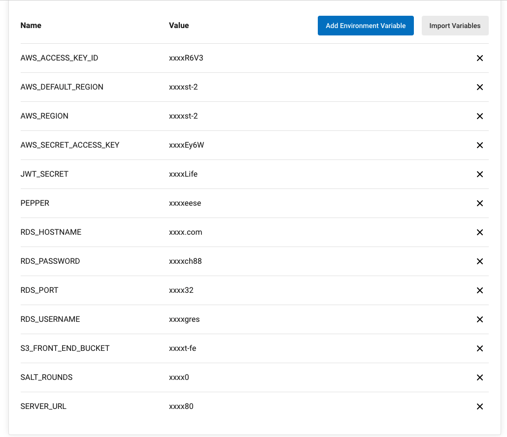

# Project Dependencies

**Node 16.14.2**

```
Npm workspaces is used for this monorepo. The packages are installed and built with this version, So for the best of luck i would stick with this version
```

<br>

**CircleCi Environment Variables**

```
The following variables needed for CircleCi are located in the project settings console.
```


