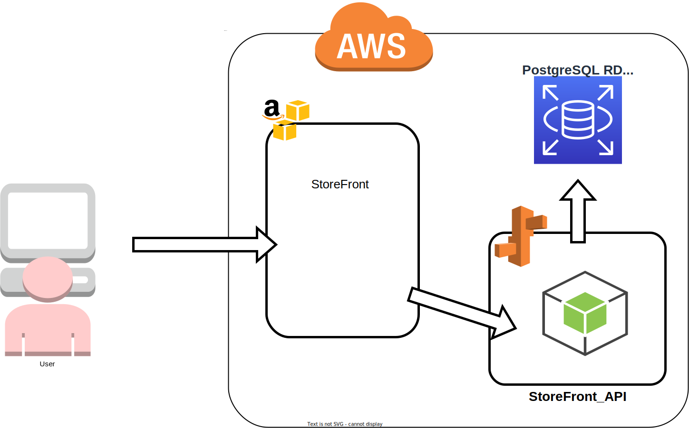
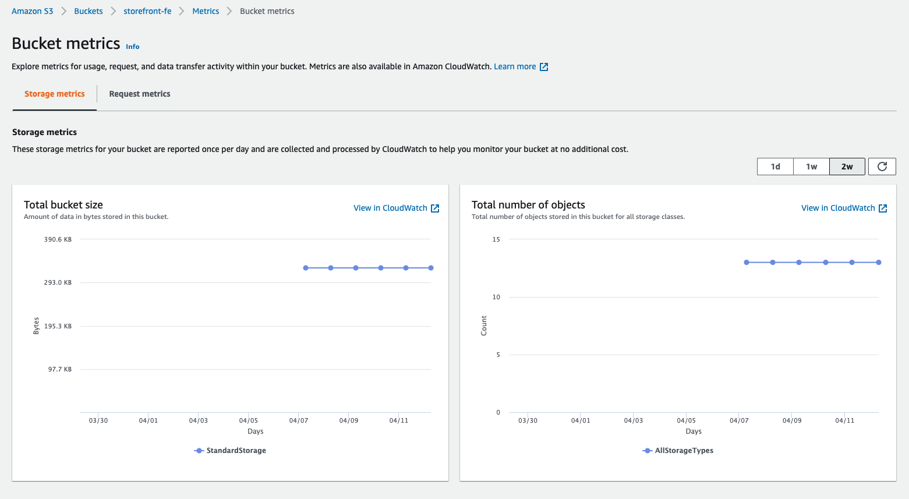
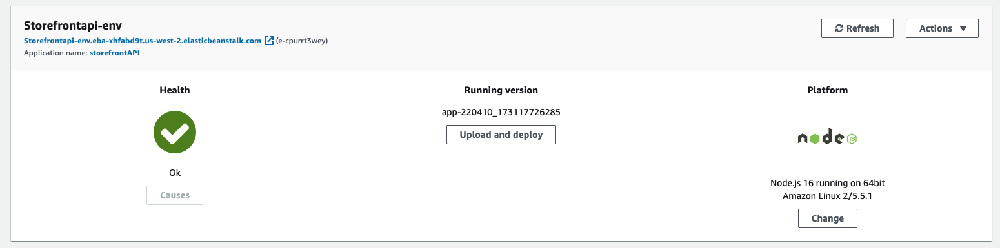
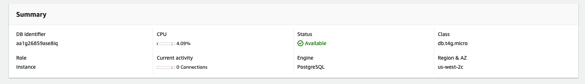

# Application Infrastructure

The diagam below shows the high level overview of how this application works. Both packages are located in the AWS cloud. The user/client requests access to the storeFront site located in an s3 storage bucket. Whenever the front-end app needs to retrieve/save information, it will communicate with the StoreFront_API server located in an Elastic Beanstalk service to do so. Attached to the Elastic Beanstalk service is a PostgreSQL RDS database where the server will store or retrieve the needed information.

 

## AWS Services Health Check

 

**StoreFront s3 bucket**

 

**Elastic Beanstalk Server Environment**

 

**RDS Postgres Availability**

 
