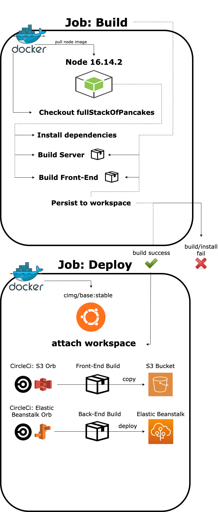

# Pipeline Process

The image below shows a high level overview of the CI/CD process.

 

## Job: Build

The process for this job is the Docker container:

1. Pulls down Node.js version 16.14.2 for the install and build process.
2. Checkout fullStackOfPancakes into the workspace.
3. Install project dependencies
4. Build StoreFront_API package.
5. Build StoreFront package.
6. If install of dependencies and both packages build successfully - Then persist them both to the workspace.

 

## Job: Deploy

The process for this job is the docker container:

1. Pulls down a stable base image
2. Attaches workspace to environment.
3. Uses the CircleCi s3 Orb to copy build to s3 bucket.
4. Uses the CircleCi Elastic Beanstalk Orb to deploy server to Elastic Beanstalk

 
 

